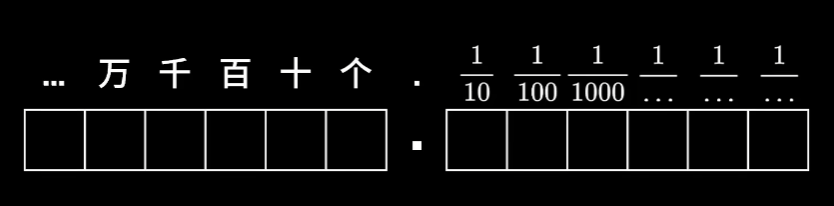
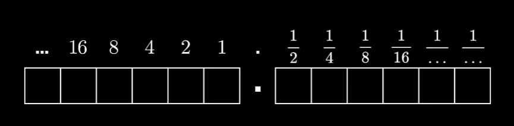

# 数制

## 数值

### 十进制


!!! 数位的含义 Note
    十进制整数部分，个位表示多少个1，十位表示有多少个10，百位表示有多少个100等等。
    十进制小数部分，从左向右依次表示多少个1/10，多少个1/100，多少个1/1000等等。

!!! 示例 Info
    - 例如十进制数：123.12
        - 有3个1
        - 有2个10
        - 有1个100
        - 有1个1/10
        - 有2个1/100

### 二进制


!!! 数位的含义 Note
    二进制整数部分，最低位向上依次表示多少个1，多少个2，多少个4等等。
    二进制小数部分，从左向右依次表示多少个1/2，多少个1/4，多少个1/8等等。

!!! 示例 Info
    - 例如二进制数：101.11
        - 有1个1
        - 有0个2
        - 有1个4
        - 有1个1/2
        - 有1个1/4

### 进制转换

#### 二进制转十进制

#### 十进制转二进制

#### 8421法

## 原码补码

### 原码表示法

我们在计算机中讨论二进制时，应该先确定讨论的**总位数**。

我们可以人为的理解当前位数下二进制的最高位。

- 有符号

- 无符号

### 原码的计算

!!! 示例 Info
    ```shell
    5 + (-5) = 0
    0000 0101        5      原码
    1000 0101       -5      原码
    ----------
    1000 1010        但是原码计算是错误的，不是0。
    ```

### 补码表示法
- 为了解决原码表示的问题，我们使用补码表示法。
- 讨论补码，要先区分正负数。正数的原码、反码、补码统统相等。
- 负数的反码是原码符号位不变，其它位取反。
- 负数的补码是负数的反码 + 1
- 得到一个补码可以从正数（0000 0101是正数，直接全部取反+1）得到，也可以从负数（1000 0101是负数，符号位不变，其余位取反+1）得到。
- 位扩展。正数左补0不改变原值。负数左补1不改变原值。

!!! 示例 Info
    ```shell
    5 + (-5) = 0
    0000 0101        5      补码
    1000 0101       -5      原码
    1111 1011       -5      补码


    0000 0101        5      补码
    1111 1011       -5      补码
    ----------
    0000 0000        0      补码
    ```

### 补码的原理分析
- 时钟溢出，得到数值循环。
- 计算机存储，在指定位数下（所以二进制计算先谈前提条件：位数）。存储溢出，得到数值循环。
- 在这样的先决条件下，以时钟为例：从8点到1点，可以 +5 个小时，也可以 -7 个小时。也就是说，在这样一个循环周期中 +5 等价于 -7 。即abs(+5) + abs(-7) = 12 = 一个时钟循环周期。
- 也就是说，以4位二进制为例。0000 ~ 1111 一共16个数，16就是循环周期。第17个数应该是0，进行了数值循环。
- 如果4位二进制下，试图求出 11 - 7 即 1011 - 0111，我们应该将0111转为它循环周期的另一半，不做减法做加法。16 - 7 = 9，也就是它的另一半是9，即1001。
- 1001就是0111的补码，1001 + 0111 补全了一个循环周期。
- 对于1001，如果看成无符号数，就是9。看成有符号原码就是-1，看成有符号补码，那就是-7。
```
    1011 - 0111 = 0100
     11  -  7   =   4

    1011 + 1001 = 0100
     11  +  9   =   4
```
<!-- - 补码  -->
