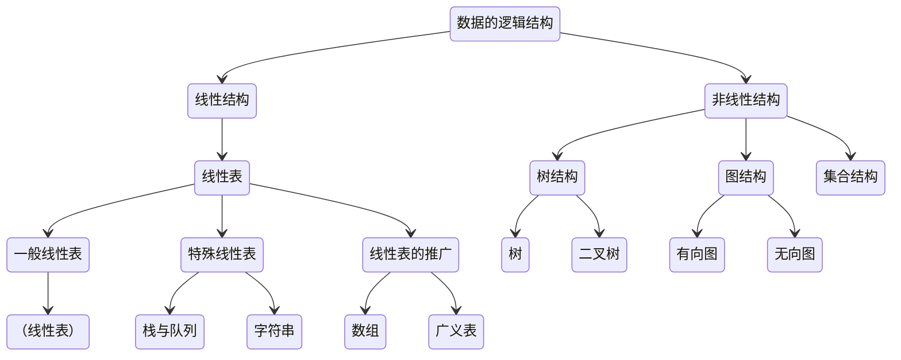

# 基本概念和术语

## 数据、数据元素、数据项和数据对象
- 数据: 是客观事物的符号表示。
- 数据元素: 是数据的基本单位。（简单理解就是一条数据记录）
- 数据项: 是组成数据元素的、有独立含义的、不可分割的最小单位。（简单理解就是数据表的字段）
- 数据对象: 是性质相同的数据元素的集合，是数据的一个子集。（例如：整数数据对象就是所有整数，字符数据对象就是所有字符。）

### 数据结构
1. 逻辑结构
    - 集合结构 
    - 线性结构 
    - 树结构 
    - 图结构 

2. 存储结构
    - 顺序存储结构 
    - 链式存储结构 




### 数据类型和抽象数据类型
1. 数据类型（Data Type）
    数据类型是高级程序设计语言中的一个基本概念。数据类型是一个值的集合和定义在这个值集上的一组操作的总称。
2. 抽象数据类型（Abstract Data Type, ADT）
    一般指由用户定义的、表示应用问题的数学模型，以及定义在这个模型上的一组操作的总称，具体包括三部分：数据对象、数据对象上关系的集合、以及对数据对象的基本操作的集合。可以用（D，S，P）三元组表示。

    !!! 抽象数据类型的定义格式 Note
        ```md
        ADT 抽象数据类型名 {
            数据对象：<数据对象的定义>
            数据关系：<数据关系的定义>
            基本操作：<基本操作的定义>
        } ADT 抽象数据类型名
        ```

    ??? 基本操作的定义格式 Note
        ```md
        基本操作名（参数表）
            初始条件：<初始条件描述>
            操作结果：<操作结果描述>
        ```

## 抽象数据类型的表示和实现

## 算法和算法分析

### 算法的定义及特性

**算法是为了解决某类问题而规定的一个有限长的操作序列**

1. 有穷性。
2. 确定性。
3. 可行性。
4. 输入。
5. 输出。

### 评价算法优劣的基本标准

1. 正确性。
2. 可读性。一个好的算法，首先应便于人们理解和相互交流。
3. 健壮性。
4. 高效性。

### 算法的时间复杂度


$$
T(n) = O(f(n))
$$

### 算法的空间复杂度
