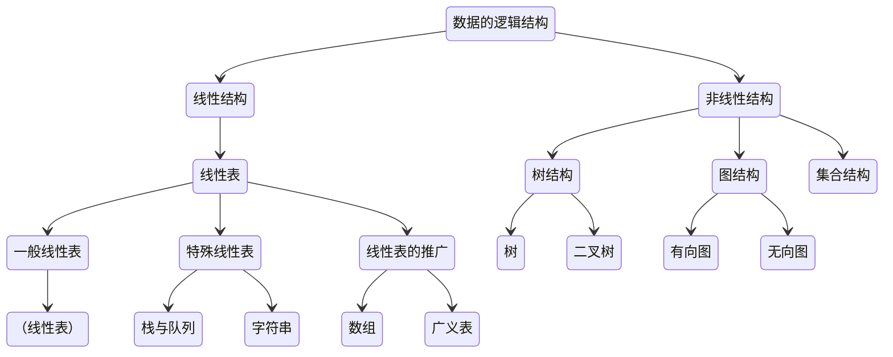

# 基本概念和术语

## 数据、数据元素、数据项和数据对象

### 基本概念
- 数据: 是客观事物的符号表示。
- 数据元素: 是数据的基本单位。（简单理解就是一条数据记录）
- 数据项: 是组成数据元素的、有独立含义的、不可分割的最小单位。（简单理解就是数据表的字段）
- 数据对象: 是性质相同的数据元素的集合，是数据的一个子集。（例如：整数数据对象就是所有整数，字符数据对象就是所有字符。）

### 数据结构
1. 逻辑结构
    - 集合结构 
    - 线性结构 
    - 树结构 
    - 图结构 

2. 存储结构
    - 顺序存储结构 
    - 链式存储结构 

## 抽象数据类型的表示和实现

## 算法和算法分析

