# 基本概念和术语

## 数据、数据元素、数据项和数据对象

### 基本概念
- 数据: 是客观事物的符号表示。
- 数据元素: 是数据的基本单位。（简单理解就是一条数据记录）
- 数据项: 是组成数据元素的、有独立含义的、不可分割的最小单位。（简单理解就是数据表的字段）
- 数据对象: 是性质相同的数据元素的集合，是数据的一个子集。（例如：整数数据对象就是所有整数，字符数据对象就是所有字符。）

### 数据结构
1. 逻辑结构
    - 集合结构 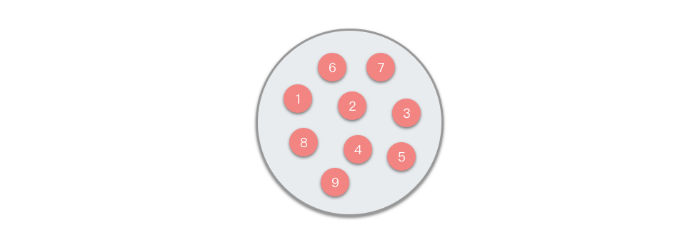
    - 线性结构 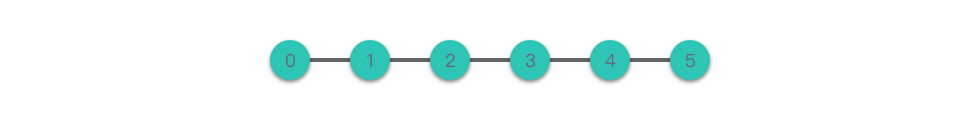
    - 树结构 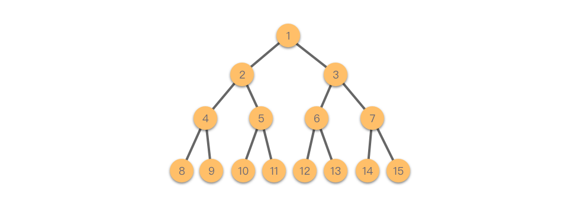
    - 图结构 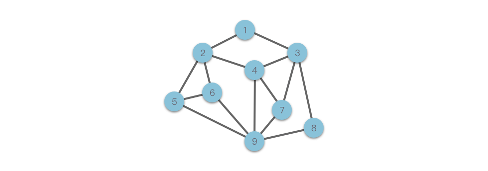

2. 存储结构
    - 顺序存储结构 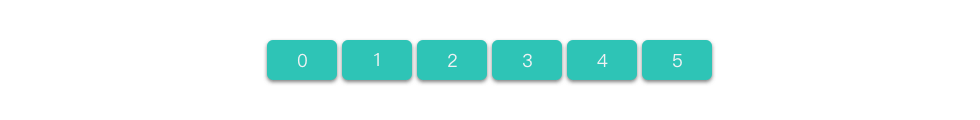
    - 链式存储结构 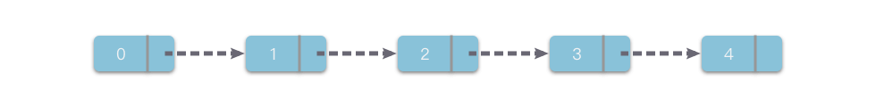


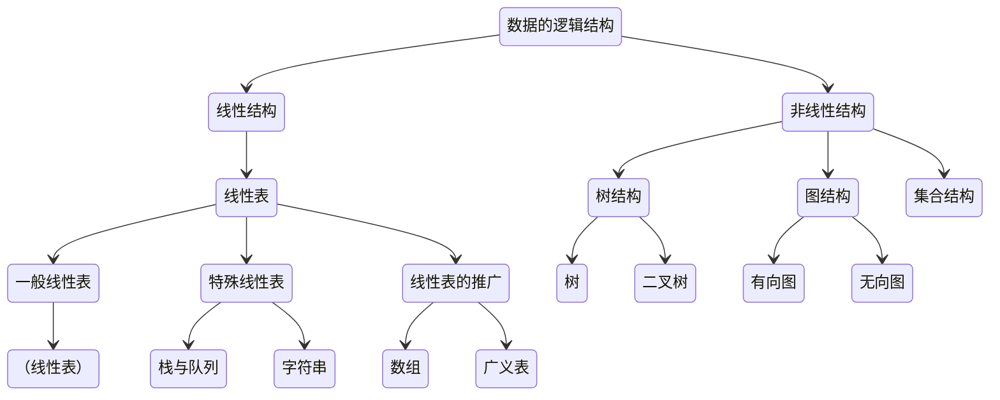

### 数据类型和抽象数据类型
1. 数据类型（Data Type）
    数据类型是高级程序设计语言中的一个基本概念。数据类型是一个值的集合和定义在这个值集上的一组操作的总称。
2. 抽象数据类型（Abstract Data Type, ADT）
    一般指由用户定义的、表示应用问题的数学模型，以及定义在这个模型上的一组操作的总称，具体包括三部分：数据对象、数据对象上关系的集合、以及对数据对象的基本操作的集合。可以用（D，S，P）三元组表示。

    !!! 抽象数据类型的定义格式 Note
        ```md
        ADT 抽象数据类型名 {
            数据对象：<数据对象的定义>
            数据关系：<数据关系的定义>
            基本操作：<基本操作的定义>
        } ADT 抽象数据类型名
        ```

    ??? 基本操作的定义格式 Note
        ```md
        基本操作名（参数表）
            初始条件：<初始条件描述>
            操作结果：<操作结果描述>
        ```

## 抽象数据类型的表示和实现

1、 定义部分
!!! 抽象数据类型定义 Note
    ```c
    ADT Complex {
        数据对象：D = {e1, e2|e1, e2∈R, R是实数集}
        数据关系：S = {<e1,e2>|e1是复数的实部，e2是复数的虚部}
        基本操作：
            Create(&C, x, y)
                操作结果：构造复数C，其实部和虚部分别被赋以参数x和y的值。
            GetReal(C)
                初始条件：复数C已存在。
                操作结果：返回复数C的实部值。
            GetImag(C)
                初始条件：复数C已存在。
                操作结果：返回复数C的虚部值。
            Add(C1, C2)
                初始条件：C1，C2是复数。
                操作结果：返回两个复数C1和C2的和。
            Sub(C1, C2)
                初始条件：C1，C2是复数。
                操作结果：返回两个复数C1和C2的差。
    } ADT Complex
    ```

2、 表示部分
!!! 抽象数据类型表示 Note
    ```c
    typedef struct          // 复数类型
    {
        float Realpart;     // 实部
        float Imagepart;    // 虚部
    } Complex;
    ```

3、 实现部分
!!! 抽象数据类型实现 Note
    ```c
    void Create(&Complex C, float x, float y)
    {
        /* 构造一个复数 */
        C.Realpart = x;
        C.Imagepart = y;
    }

    float GetReal(Complex C)
    {
        /* 取复数C = x + yi 的实部 */
        return C.Realpart;
    }

    float GetImag(Complex C)
    {
        /* 取复数C = x + yi 的虚部 */
        return C.Imagepart;
    }

    Complex Add(Complex C1, Complex C2)
    {
        /* 求两个复数C1和C2的和sum */
        Complex sum;
        sum.Realpart = C1.Realpart + C2.Realpart;
        sum.Imagepart = C1.Imagepart + C2.Imagepart;
        return sum;
    }

    Complex Sub(Complex C1, Complex C2)
    {
        /* 求两个复数C1和C2的差difference */
        Complex difference;
        difference.Realpart = C1.Realpart - C2.Realpart;
        difference.Imagepart = C1.Imagepart - C2.Imagepart;
        return difference;
    }
    ```


## 算法和算法分析

### 算法的定义及特性

**算法是为了解决某类问题而规定的一个有限长的操作序列**

1. 有穷性。
2. 确定性。
3. 可行性。
4. 输入。一个算法有零个或多个输入。
5. 输出。一个算法有一个或多个输出。

### 评价算法优劣的基本标准

1. 正确性。
2. 可读性。一个好的算法，首先应便于人们理解和相互交流。
3. 健壮性。
4. 高效性。

### 算法的时间复杂度

#### 渐近分析
算法的效率取决于执行算法所需的时间，存储空间和其他资源。 借助渐近符号来测量效率。对于不同类型的输入，算法可能不会具有相同的性能。 随着输入大小的增加，性能将会改变。将算法性能随输入大小顺序的变化而进行的研究定义为渐近分析。

#### 渐近符号
渐进符号是当输入趋于特定值或极限值时用于描述算法运行时间的数学符号。例如：在冒泡排序中，当输入数组已经排序时，算法花费的时间是线性的，即最佳情况。但是，当输入数组处于反向条件时，该算法将花费最大时间（二次）对元素进行排序，即最坏的情况。当输入数组既未排序也不反向时，则需要平均时间。 这些持续时间使用渐近符号表示。**主要有三种渐近符号：Theta 符号，Omega 符号和大 O 符号。**

#### Theta 表示法（Θ 表示法）
Theta 表示法从上方和下方将函数括起来。 由于它代表算法运行时间的上限和下限，因此可用于分析算法的平均用例复杂度。
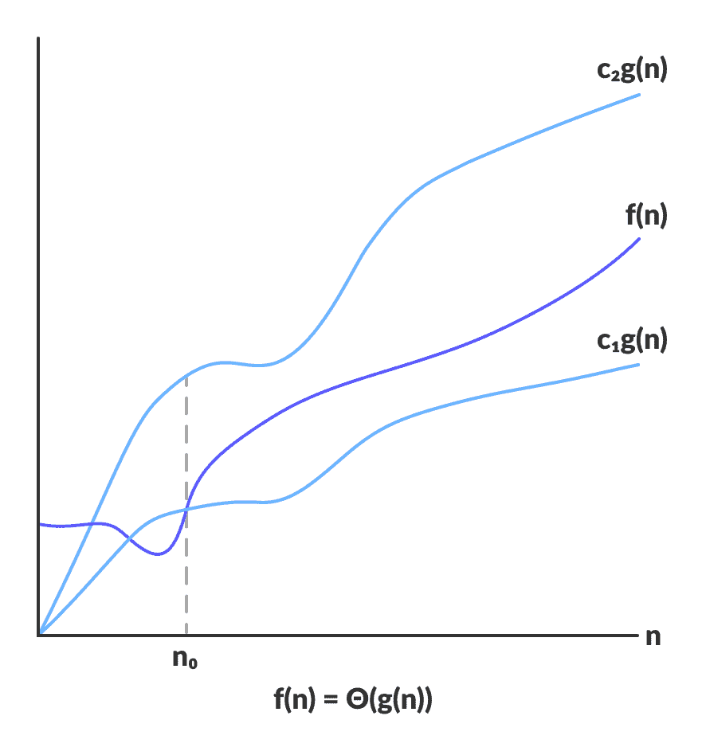
Theta 将函数限制在常数因子之内，对于函数$ g(n) $ ，$ Θ(g(n)) $由以下关系式给出：
    $$ \Theta(g(n)) = f(n) : \text{存在正的常数} c_1, c_2 \text{和} n_0, $$
    $$ \text{使得对于所有的} n \geq n_0, \text{有} 0 \leq c_1g(n) \leq f(n) \leq c_2g(n) $$

#### 大O表示法（O 表示法）
大 O 表示法表示算法运行时间的上限。 因此，它给出了算法的最坏情况的复杂度。
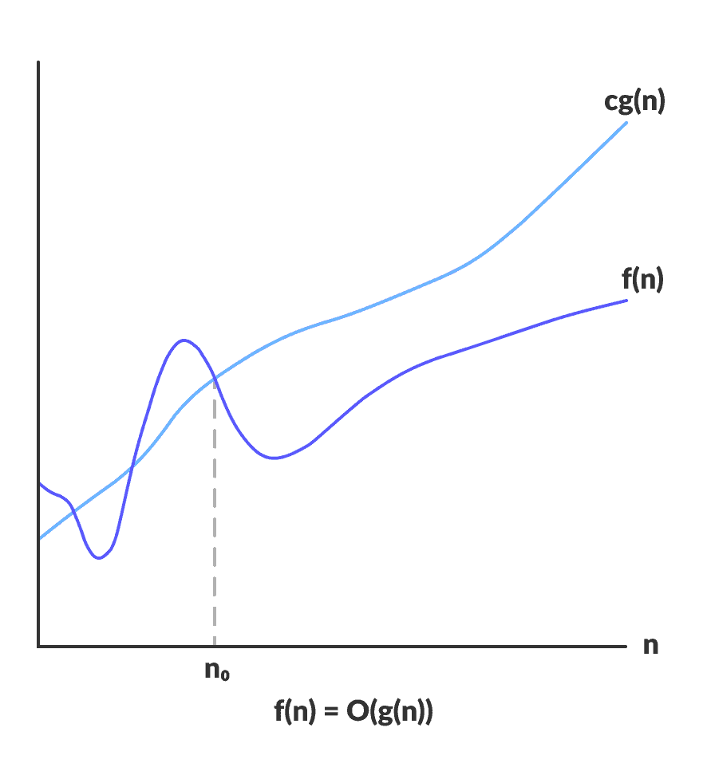
大 O 给出函数的上限：
    $$  O(g(n)) =  f(n) : \text{存在正的常数} c \text{和} n_0, $$
    $$ \text{使得对于所有的} n \geq n_0, \text{有} 0 \leq f(n) \leq cg(n) $$

#### Ω 表示法（Ω表示法）
Ω 表示算法运行时间的下限。 因此，它提供了算法的最佳情况复杂度。
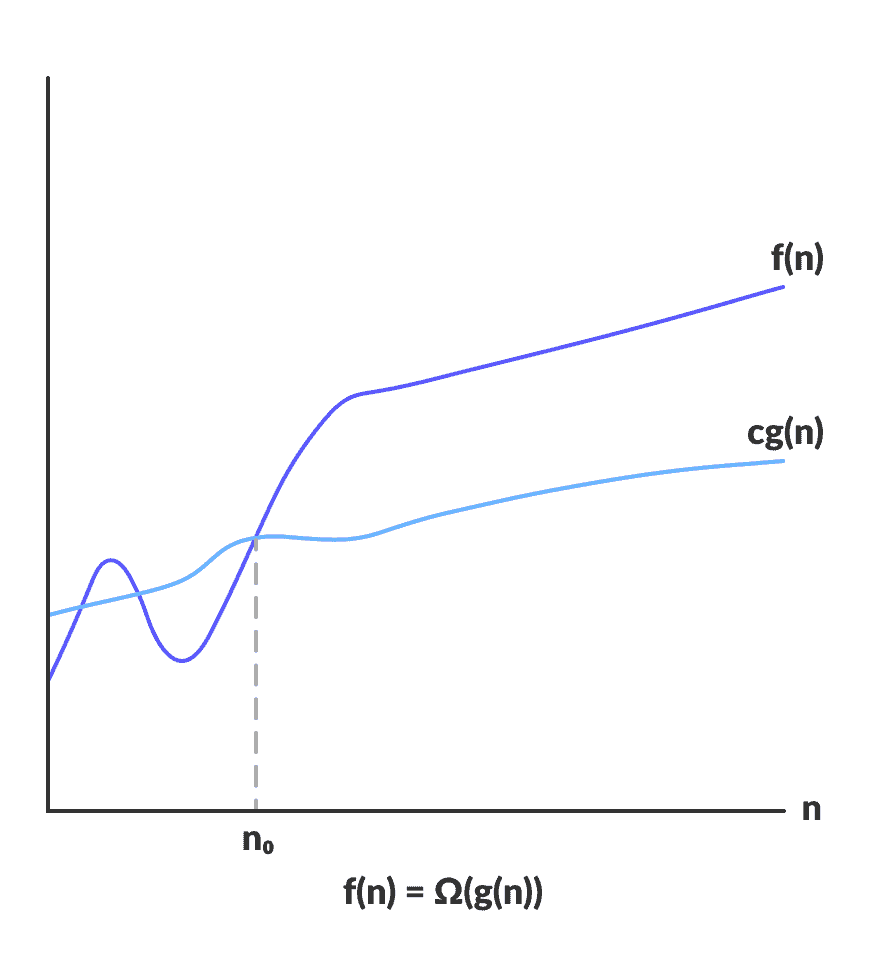
Ω 给出函数的下限：
    $$ \Omega(g(n)) = f(n) : \text{存在正的常数} c \text{和} n_0, $$
    $$ \text{使得对于所有的} n \geq n_0, \text{有} 0 \leq cg(n) \leq f(n) $$

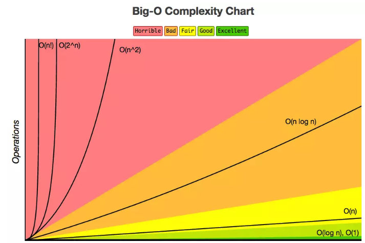


### 算法的空间复杂度

关于算法的存储空间需求，类似于算法的时间复杂度，我们采用渐近**空间复杂度（Space Complexity）**作为算法所需存储空间的量度，简称空间复杂度，它也是问题规模n的函数，记作：
$$
    S(n) = O(f(n))
$$

一般情况下，一个程序在机器上执行时，除了需要寄存本身所用的指令、常数、变量和输入数据外，还需要一些对数据进行操作的辅助存储空间。其中，对于输入数据所占的具体存储量取决于问题本身，与算法无关，这样只需分析该算法在实现时所需要的辅助空间就可以了。若算法执行时所需要的辅助空间相对于输入数据量而言是个常数，则称这个算法为原地工作，辅助空间为 $ O(1) $。

对于一个算法，其时间复杂度和空间复杂度往往相互影响，当追求一个较好的时间复杂度时，可能会导致占用较多的存储空间，即可能会使空间复杂度性能变差，反之亦然。不过，通常情况下，鉴于运算空间较为充足，人们都以算法的时间复杂度作为算法优劣的衡量指标。

